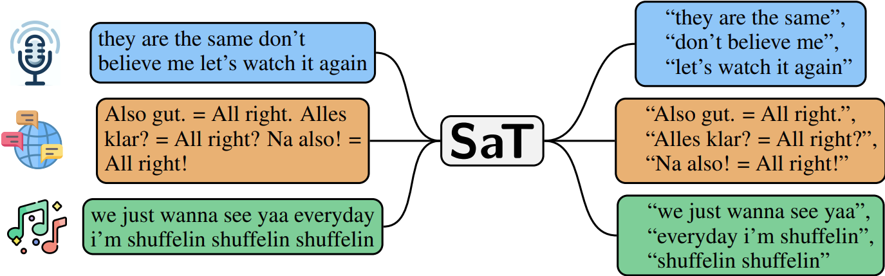

<h1 align="center">wtpsplit🪓</h1>
<h3 align="center">Segment any Text - Robustly, Efficiently, Adaptably⚡</h3>

This repository allows you to segment text into sentences or other semantic units. It implements the models from:

- **SaT** &mdash; [Segment Any Text: A Universal Approach for Robust, Efficient and Adaptable Sentence Segmentation](https://arxiv.org/abs/2406.16678) by Markus Frohmann, Igor Sterner, Benjamin Minixhofer, Ivan Vulić and Markus Schedl (**state-of-the-art, encouraged**).
- **WtP** &mdash; [Where’s the Point? Self-Supervised Multilingual Punctuation-Agnostic Sentence Segmentation](https://aclanthology.org/2023.acl-long.398/) by Benjamin Minixhofer, Jonas Pfeiffer and Ivan Vulić (*previous version, maintained for reproducibility*).

The namesake WtP is maintained for consistency. Our new followup SaT provides robust, efficient and adaptable sentence segmentation across 85 languages at higher performance and less compute cost. Check out the **state-of-the-art** results in 8 distinct corpora and 85 languages demonstrated in our [Segment any Text paper](https://arxiv.org/abs/2406.16678).



## Installation

```bash
pip install wtpsplit
```
Or one of the following for ONNX support:
```bash
pip install wtpsplit[onnx-gpu]
pip install wtpsplit[onnx-cpu]
```

## Usage

```python
from wtpsplit import SaT

sat = SaT("sat-3l")
# Select a PyTorch device at construction time:
# sat = SaT("sat-3l", device="cuda")
# sat = SaT("sat-3l", device="mps")  # Apple Silicon

sat.split("This is a test This is another test.")
# returns ["This is a test ", "This is another test."]

result = sat.segment("This is a test This is another test.")
# result.sentences, result.spans, result.probabilities, and result.confidences are available

# do this instead of calling sat.split on every text individually for much better performance
sat.split(["This is a test This is another test.", "And some more texts..."])
# returns a list containing one sentence list per text
# pass lazy=True to return an iterator for very large batches

# use our '-sm' models for general sentence segmentation tasks
sat_sm = SaT("sat-3l-sm")
sat_sm.split("this is a test this is another test")
# returns ["this is a test ", "this is another test"]

# use trained lora modules for strong adaptation to language & domain/style
sat_adapted = SaT("sat-3l", domain="ud", language="en")
sat_adapted.split("This is a test This is another test.")
# returns ['This is a test ', 'This is another test']
```

## ONNX Support

🚀 You can now enable even faster ONNX inference for `sat` and `sat-sm` models! 🚀

```python
sat = SaT("sat-3l-sm", ort_providers=["CUDAExecutionProvider", "CPUExecutionProvider"])
```

```python
from wtpsplit import SaT
texts = ["This is a sentence. This is another sentence."] * 1000

# PyTorch GPU
model_pytorch = SaT("sat-3l-sm")
model_pytorch.half().to("cuda")
# In IPython: %timeit model_pytorch.split(texts)
# 144 ms ± 252 μs per loop (mean ± std. dev. of 7 runs, 10 loops each)
# quite fast already, but...

# onnxruntime GPU
model_ort = SaT("sat-3l-sm", ort_providers=["CUDAExecutionProvider", "CPUExecutionProvider"])
# In IPython: %timeit model_ort.split(texts)
# 94.9 ms ± 165 μs per loop (mean ± std. dev. of 7 runs, 10 loops each
# ...this should be ~50% faster! (tested on RTX 3090)
```

If you wish to use LoRA in combination with an ONNX model:

- Run `scripts/export_to_onnx_sat.py` with `use_lora: True` and an appropriate `output_dir: <OUTPUT_DIR>`.
  - If you have a local LoRA module, use `lora_path`.
  - If you wish to load a LoRA module from the HuggingFace hub, use `domain` and `language`.
- Load the ONNX model with merged LoRA weights:
  `sat = SaT(<OUTPUT_DIR>, ort_providers=["CUDAExecutionProvider", "CPUExecutionProvider"])`

## Available Models

If you need a general sentence segmentation model, use `-sm` models (e.g., `sat-3l-sm`)
For speed-sensitive applications, we recommend 3-layer models (`sat-3l` and `sat-3l-sm`). They provide a great tradeoff between speed and performance.
The best models are our 12-layer models: `sat-12l` and `sat-12l-sm`.

| Model                                                                        | English Score | Multilingual Score |
| :--------------------------------------------------------------------------- | ------------: | -----------------: |
| [sat-1l](https://huggingface.co/segment-any-text/sat-1l)                        |          88.5 |               84.3 |
| [sat-1l-sm](https://huggingface.co/segment-any-text/sat-1l-sm)                  |          88.2 |               87.9 |
| [sat-3l](https://huggingface.co/segment-any-text/sat-3l)                        |          93.7 |               89.2 |
| [sat-3l-lora](https://huggingface.co/segment-any-text/sat-3l/tree/main/loras)   |          96.7 |               94.8 |
| [sat-3l-sm](https://huggingface.co/segment-any-text/sat-3l-sm)                  |          96.5 |               93.5 |
| [sat-6l](https://huggingface.co/segment-any-text/sat-6l)                        |          94.1 |               89.7 |
| [sat-6l-sm](https://huggingface.co/segment-any-text/sat-6l-sm)                  |          96.9 |               95.1 |
| [sat-9l](https://huggingface.co/segment-any-text/sat-9l)                        |          94.3 |               90.3 |
| [sat-12l](https://huggingface.co/segment-any-text/sat-12l)                      |          94.0 |               90.4 |
| [sat-12l-lora](https://huggingface.co/segment-any-text/sat-12l/tree/main/loras) |          97.3 |               95.9 |
| [sat-12l-sm](https://huggingface.co/segment-any-text/sat-12l-sm)                |          97.4 |               96.0 |

The scores are macro-average F1 score across all available datasets for "English", and macro-average F1 score across all datasets and languages for "Multilingual". "adapted" means adapation via LoRA; check out the [paper](https://arxiv.org/abs/2406.16678) for details.

For comparison, here the English scores of some other tools:

| Model                                                    | English Score |
| :------------------------------------------------------- | ------------: |
| PySBD                                                    |          69.6 |
| SpaCy (sentencizer; monolingual)                         |          92.9 |
| SpaCy (sentencizer; multilingual)                        |          91.5 |
| Ersatz                                                   |          91.4 |
| Punkt (`nltk.sent_tokenize`)                           |          92.2 |
| [WtP (3l)](https://huggingface.co/benjamin/wtp-canine-s-3l) |          93.9 |

The legacy [`WtP`](https://arxiv.org/abs/2305.18893) models remain available for reproducibility. Install them with `pip install "wtpsplit[legacy]"`, then use them in essentially the same way as `SaT` models:

```python
from wtpsplit import WtP

wtp = WtP("wtp-bert-mini")
# similar functionality as for SaT models
wtp.split("This is a test This is another test.")
```

For more details on WtP and reproduction details, see the [WtP doc](./README_WTP.md).

## Paragraph Segmentation

Since SaT are trained to predict newline probablity, they can segment text into paragraphs in addition to sentences.

```python
# returns a list of paragraphs, each containing a list of sentences
# adjust the paragraph threshold via the `paragraph_threshold` argument.
sat.split(text, do_paragraph_segmentation=True)
```

## (NEW! v2.2+) Length-Constrained Segmentation

Control segment lengths with `min_length` and `max_length` parameters. This is useful when you need segments within specific size limits (e.g., for embedding models, storage, or downstream processing).

### Basic Usage

```python
from wtpsplit import SaT

sat = SaT("sat-3l-sm")

text = (
    "In the beginning God created the heaven and the earth. "
    "And the earth was without form, and void; and darkness was upon the face of the deep. "
    "And the Spirit of God moved upon the face of the waters. "
    "And God said, Let there be light: and there was light. "
    "And God saw the light, that it was good: and God divided the light from the darkness. "
    "And God called the light Day, and the darkness he called Night. "
    "And the evening and the morning were the first day."
)

# Split with a maximum segment length of 120 characters
segments = sat.split(text, max_length=120)
for i, s in enumerate(segments):
    print(f"[{len(s):3d} chars] {s}")
# [ 55 chars] In the beginning God created the heaven and the earth. 
# [ 86 chars] And the earth was without form, and void; and darkness was upon the face of the deep. 
# [112 chars] And the Spirit of God moved upon the face of the waters. And God said, Let there be light: and there was light. 
# [ 86 chars] And God saw the light, that it was good: and God divided the light from the darkness. 
# [115 chars] And God called the light Day, and the darkness he called Night. And the evening and the morning were the first day.

assert "".join(segments) == text  # text is perfectly preserved

# Enforce both min and max length
sat.split(text, min_length=80, max_length=200)

# Use the greedy algorithm for minimally faster (but less optimal) results
sat.split(text, max_length=120, algorithm="greedy")
```

### Priors for Length Preference

Use priors to influence segment length distribution. Available priors:

| Prior | Best For |
|-------|----------|
| `"uniform"` (default) | Just enforce max_length, let model decide |
| `"gaussian"` | Prefer segments around a target length (intuitive) |
| `"lognormal"` | Right-skewed preference (more tolerant of longer segments) |
| `"clipped_polynomial"` | Must be very close to target length |

```python
# Gaussian prior (recommended): prefer segments around target_length
sat.split(text, max_length=100, prior_type="gaussian", 
          prior_kwargs={"target_length": 50, "spread": 10})

# Log-normal prior: right-skewed (more tolerant of longer segments)
sat.split(text, max_length=100, prior_type="lognormal", 
          prior_kwargs={"target_length": 70, "spread": 25})

# Clipped polynomial: hard cutoff at ±spread from target
sat.split(text, max_length=100, prior_type="clipped_polynomial", 
          prior_kwargs={"target_length": 60, "spread": 25})
```

### Language-Aware Defaults

Pass `lang_code` to use language-specific defaults for `target_length` and `spread` (based on language-specific corpus statistics):

```python
# German has longer average sentences → auto-uses target_length=90, spread=35
sat.split(text, max_length=150, prior_type="gaussian", 
          prior_kwargs={"lang_code": "de"})

# Chinese has shorter sentences → auto-uses target_length=45, spread=15
sat.split(text, max_length=100, prior_type="gaussian", 
          prior_kwargs={"lang_code": "zh"})
```

When using LoRA with a language, this happens automatically:

```python
sat = SaT("sat-3l", domain="ud", language="de")
sat.split(text, max_length=150, prior_type="gaussian")  # auto-uses German defaults
```

### How It Works

The Viterbi algorithm finds globally optimal segmentation points that balance:
- The model's sentence boundary predictions (where natural splits occur)
- Your length preferences (via the prior; if provided)

**Text Reconstruction:**
```python
# With constraints (max_length or min_length):
original_text = "".join(segments)  # segments may contain newlines

# Without constraints (SaT default with split_on_input_newlines=True):
original_text = "\n".join(segments)
```

> **Note**: When using length constraints, segments may contain newlines. If you want to remove them, you can just post-process the output.

> **Note**: When `max_length` is set, the `threshold` parameter is ignored. The Viterbi/greedy algorithms use raw model probabilities directly instead of threshold-based filtering.

For more details, see the [Length Constraints Documentation](./docs/LENGTH_CONSTRAINTS.md).

## Adaptation

SaT can be domain- and style-adapted via LoRA. We provide trained LoRA modules for Universal Dependencies, OPUS100, Ersatz, and TED (i.e., ASR-style transcribed speeches) sentence styles in 81 languages for `sat-3l`and `sat-12l`. Additionally, we provide LoRA modules for legal documents (laws and judgements) in 6 languages, code-switching in 4 language pairs, and tweets in 3 languages. For details, we refer to our [paper](https://arxiv.org/abs/2406.16678).

We also provided verse segmentation modules for 16 genres for `sat-12-no-limited-lookahead`.

Load LoRA modules like this:

```python

# requires both language and domain
# for available ones, check the <model_repository>/loras folder
sat_lora = SaT("sat-3l", domain="ud", language="en")
sat_lora.split("Hello this is a test But this is different now Now the next one starts looool")
# now for a highly distinct domain
sat_lora_distinct = SaT("sat-12l", domain="code-switching", language="es-en")
sat_lora_distinct.split("in the morning over there cada vez que yo decía algo él me decía algo")
```

You can also freely adapt the segmentation threshold, with a higher threshold leading to more conservative segmentation:

```python

sat.split("This is a test This is another test.", threshold=0.4)
# works similarly for lora; but thresholds are higher
sat_lora.split("Hello this is a test But this is different now Now the next one starts looool", threshold=0.7)
```

## Advanced Usage

### Get the newline or sentence boundary probabilities for a text:

```python
# returns newline probabilities (supports batching!)
sat.predict_proba(text)
```

### Load a SaT model in [HuggingFace `transformers`](https://github.com/huggingface/transformers):

```python
# import library to register the custom models 
import wtpsplit.models
from transformers import AutoModelForTokenClassification

model = AutoModelForTokenClassification.from_pretrained("segment-any-text/sat-3l-sm") # or some other model name; see https://huggingface.co/segment-any-text
```

### Local and in-process LoRA adapters

Pretrained LoRA adapters can be selected with `domain` and `language`, or loaded from a local adapter directory with `lora_path`. wtpsplit 3 merges these weights directly into the model, so inference does not require AdapterHub.

```python
sat_adapted = SaT("sat-3l", domain="ud", language="en")
sat_adapted.split("This is a test This is another test.")
```

To adapt a PyTorch model to your own segmentation style, pass one gold sentence
per list item. Adaptation mutates and returns the same model, stays entirely
in memory, and works on CPU, CUDA, and MPS:

```python
few_shot = SaT("sat-3l-sm", device="cpu")
few_shot.adapt(
    [
        "A gold sentence.",
        "Another sentence using the desired style.",
        "A third example.",
    ],
    language="en",
)
few_shot.split("A gold sentence. Another sentence using the desired style.")

# Optional: write an adapter compatible with `lora_path`.
few_shot.save_adapter("./my-adapter")
reloaded = SaT("sat-3l-sm", lora_path="./my-adapter")
```

The defaults reproduce the paper-era LoRA setup (`r=16`, `alpha=32`, 30
epochs). Pass `epochs`, `learning_rate`, `batch_size`, or `block_size` to tune
the short in-process run. Construct a fresh base model before training another
adapter; adapting an already merged or compiled model is rejected.

On macOS 15.6 arm64 with PyTorch 2.13, `sat-3l-sm` adapted to 100 repetitive
generated sentences for the default 30 epochs in 6.51 seconds on CPU (model
loading excluded). Those sentences pack into six token blocks and one batch per
epoch, so this measurement covers only 30 optimizer steps; diverse or longer
data and larger models will take longer. Reproduce it with
`scripts/benchmark_adapt.py`.

Held-out quality was measured on 200 German BOUQuET sentences, grouped into 20
ten-sentence documents. The unadapted `sat-3l-sm` macro F1 was 0.9129; after 30
epochs it was 0.9268 with 10 adaptation sentences (`+0.0139`), 0.9224 with 50
(`+0.0095`), and 0.9211 with 100 (`+0.0082`). More examples did not improve
this small same-corpus experiment, so treat the shot count as a hyperparameter
rather than assuming monotonic gains. Reproduce it with
`scripts/evaluate_adaptation.py`.

### Devices and `torch.compile`

Use `device=` for PyTorch inference. ONNX devices continue to be selected with
`ort_providers=`. Compilation is opt-in and accepts either `True` or keyword
arguments forwarded to `torch.compile`:

```python
sat = SaT("sat-3l-sm", device="cuda", compile=True)
# For example: compile={"mode": "reduce-overhead", "dynamic": True}
```

MPS is supported and covered by a device test when available. Compilation is
workload- and backend-dependent, so benchmark before enabling it. Using
`scripts/benchmark_compile.py` with `sat-3l-sm`, a batch of eight repeated
paragraphs, PyTorch 2.13, and macOS 15.6 arm64:

- CPU: 62.69 ms eager, 54.83 ms compiled (`1.14x` speedup).
- MPS: 21.48 ms eager, 78.24 ms compiled (`0.27x`; compilation was slower).

## Reproducing the paper

Research modules are available from a source checkout using the environment
documented in [`RESEARCH.md`](RESEARCH.md). Stage 1 data, training, and
evaluation are described in [`docs/STAGE1.md`](docs/STAGE1.md):

```bash
uv sync --locked --group research --extra legacy
uv run python wtpsplit/train/train.py configs/your_config.json
uv run python wtpsplit/train/train_SM.py configs/your_config.json
```

In addition:

- `wtpsplit/data_acquisition` contains the code for obtaining evaluation data and raw text from the mC4 corpus.
- `wtpsplit/evaluation` contains the code for:
  - evaluation (i.e. sentence segmentation results) via `adapt.py`.
  - short-sequence evaluation (i.e. sentence segmentation results for pairs/k-mers of sentences) via `intrinsic_pairwise.py`.
  - LLM baseline evaluation (`llm_sentence.py`), legal baseline evaluation (`legal_baselines.py`)
  - baseline (PySBD, nltk, etc.) evaluation results in `intrinsic_baselines.py` and `intrinsic_baselines_multi.py`
  - Raw results in JSON format are also in `evaluation_results/`
  - Statistical significane testing code and results ara in `stat_tests/`
  - punctuation annotation experiments in `punct_annotation.py` and `punct_annotation_wtp.py` (WtP only)
  - extrinsic evaluation on Machine Translation in `extrinsic.py` (WtP only)

## Supported Languages

<details>
  <summary>Table with supported languages</summary>

| iso | Name            |
| :-- | :-------------- |
| af  | Afrikaans       |
| am  | Amharic         |
| ar  | Arabic          |
| az  | Azerbaijani     |
| be  | Belarusian      |
| bg  | Bulgarian       |
| bn  | Bengali         |
| ca  | Catalan         |
| ceb | Cebuano         |
| cs  | Czech           |
| cy  | Welsh           |
| da  | Danish          |
| de  | German          |
| el  | Greek           |
| en  | English         |
| eo  | Esperanto       |
| es  | Spanish         |
| et  | Estonian        |
| eu  | Basque          |
| fa  | Persian         |
| fi  | Finnish         |
| fr  | French          |
| fy  | Western Frisian |
| ga  | Irish           |
| gd  | Scottish Gaelic |
| gl  | Galician        |
| gu  | Gujarati        |
| ha  | Hausa           |
| he  | Hebrew          |
| hi  | Hindi           |
| hu  | Hungarian       |
| hy  | Armenian        |
| id  | Indonesian      |
| ig  | Igbo            |
| is  | Icelandic       |
| it  | Italian         |
| ja  | Japanese        |
| jv  | Javanese        |
| ka  | Georgian        |
| kk  | Kazakh          |
| km  | Central Khmer   |
| kn  | Kannada         |
| ko  | Korean          |
| ku  | Kurdish         |
| ky  | Kirghiz         |
| la  | Latin           |
| lt  | Lithuanian      |
| lv  | Latvian         |
| mg  | Malagasy        |
| mk  | Macedonian      |
| ml  | Malayalam       |
| mn  | Mongolian       |
| mr  | Marathi         |
| ms  | Malay           |
| mt  | Maltese         |
| my  | Burmese         |
| ne  | Nepali          |
| nl  | Dutch           |
| no  | Norwegian       |
| pa  | Panjabi         |
| pl  | Polish          |
| ps  | Pushto          |
| pt  | Portuguese      |
| ro  | Romanian        |
| ru  | Russian         |
| si  | Sinhala         |
| sk  | Slovak          |
| sl  | Slovenian       |
| sq  | Albanian        |
| sr  | Serbian         |
| sv  | Swedish         |
| ta  | Tamil           |
| te  | Telugu          |
| tg  | Tajik           |
| th  | Thai            |
| tr  | Turkish         |
| uk  | Ukrainian       |
| ur  | Urdu            |
| uz  | Uzbek           |
| vi  | Vietnamese      |
| xh  | Xhosa           |
| yi  | Yiddish         |
| yo  | Yoruba          |
| zh  | Chinese         |
| zu  | Zulu            |

</details>

For details, please see our [Segment any Text paper](https://arxiv.org/abs/2406.16678).

## Community Ports

- **Rust**: [wtsplit-rs](https://github.com/19h/wtsplit-rs) by [@19h](https://github.com/19h)

*Note: Community ports are independently maintained and may have different feature sets or update schedules.*

## Citations

For the `SaT` models, please kindly cite our paper:

```
@inproceedings{frohmann-etal-2024-segment,
    title = "Segment Any Text: A Universal Approach for Robust, Efficient and Adaptable Sentence Segmentation",
    author = "Frohmann, Markus  and
      Sterner, Igor  and
      Vuli{\'c}, Ivan  and
      Minixhofer, Benjamin  and
      Schedl, Markus",
    editor = "Al-Onaizan, Yaser  and
      Bansal, Mohit  and
      Chen, Yun-Nung",
    booktitle = "Proceedings of the 2024 Conference on Empirical Methods in Natural Language Processing",
    month = nov,
    year = "2024",
    address = "Miami, Florida, USA",
    publisher = "Association for Computational Linguistics",
    url = "https://aclanthology.org/2024.emnlp-main.665",
    pages = "11908--11941"
}

```

For the library and the WtP models, please cite:

```
@inproceedings{minixhofer-etal-2023-wheres,
    title = "Where{'}s the Point? Self-Supervised Multilingual Punctuation-Agnostic Sentence Segmentation",
    author = "Minixhofer, Benjamin  and
      Pfeiffer, Jonas  and
      Vuli{\'c}, Ivan",
    booktitle = "Proceedings of the 61st Annual Meeting of the Association for Computational Linguistics (Volume 1: Long Papers)",
    month = jul,
    year = "2023",
    address = "Toronto, Canada",
    publisher = "Association for Computational Linguistics",
    url = "https://aclanthology.org/2023.acl-long.398",
    pages = "7215--7235"
}
```

## Acknowledgments

This research was funded in whole or in part by the Austrian Science Fund (FWF): P36413, P33526, and DFH-23, and by the State of Upper Austria and the Federal Ministry of Education, Science, and Research, through grants LIT-2021-YOU-215. In addition, Ivan Vulic and Benjamin Minixhofer have been supported through the Royal Society University Research Fellowship ‘Inclusive and Sustainable Language Technology for a Truly Multilingual World’ (no 221137) awarded to Ivan Vulić. This research has also been supported with Cloud TPUs from Google’s TPU Research Cloud (TRC). This work was also supported by compute credits from a Cohere For AI Research Grant, these grants are designed to support academic partners conducting research with the goal of releasing scientific artifacts and data for good projects. We also thank Simone Teufel for fruitful discussions.

---

For any questions, please create an issue or send an email to markus.frohmann@gmail.com, and I will get back to you as soon as possible.
